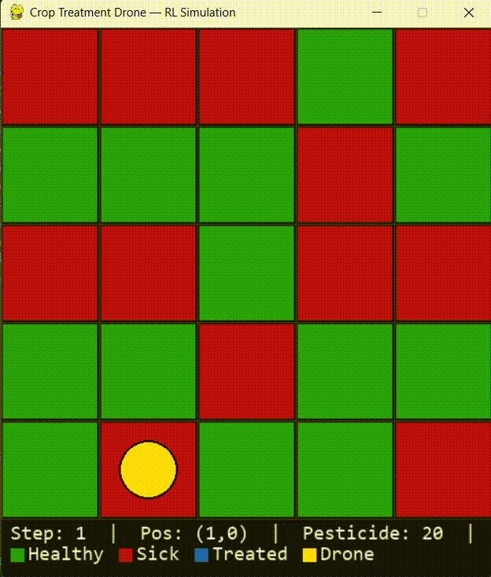

# Intelligent Crop Treatment Drone using Reinforcement Learning


A reinforcement learning system where a drone agent navigates a farm grid environment, identifies unhealthy (sick) crops, and applies pesticide treatment efficiently. The project implements four RL algorithms with optimised hyperparameters and uses a Gymnasium-compatible Pygame-based 2D simulation.

## Features

- **Pygame 2D Simulation** — Gymnasium-compatible grid-based farm environment with real-time Pygame rendering
- **Multiple RL Algorithms** — DQN, PPO, A2C, and REINFORCE implementations with optimised hyperparameters
- **Optimised for Navigation & Spraying** — Larger neural networks (256x256), tuned exploration, and reward shaping help the drone find and treat all sick crops
- **CSV Training Results** — Automated post-training evaluation that saves performance metrics (reward, accuracy, crops treated) to `results/training_results.csv`
- **TensorBoard Logging** — Full training metric visualization (rewards, episode length, crops treated)
- **Modular Architecture** — Clean separation between environment, training, and evaluation code

## Project Structure

```
├── environment/
│   ├── __init__.py
│   ├── unity_env_wrapper.py        # Gymnasium wrapper + Pygame 2D simulation
│   └── config.py                   # Environment configuration (grid, rewards, etc.)
│
├── training/
│   ├── __init__.py
│   ├── dqn_training.py             # Deep Q-Network training (optimised)
│   ├── ppo_training.py             # Proximal Policy Optimization training (optimised)
│   ├── a2c_training.py             # Advantage Actor-Critic training (optimised)
│   ├── reinforce_training.py       # Vanilla Policy Gradient (custom PyTorch, optimised)
│   └── utils.py                    # Shared utilities, callbacks, and CSV export
│
├── models/                         # Saved model checkpoints (per algorithm)
│   ├── dqn/
│   ├── ppo/
│   ├── a2c/
│   └── reinforce/
│
├── results/
│   ├── training_results.csv        # Aggregated training results across all algorithms
│   ├── logs/                       # TensorBoard logs
│   └── plots/                      # Generated plots
│
├── scripts/
│   ├── run_random_agent.py         # Baseline random agent
│   └── evaluate_model.py           # Model evaluation script
│
├── main.py                         # Run inference with best trained model
├── requirements.txt
├── README.md
└── .gitignore
```

## Setup

### Prerequisites

- Python 3.9+
- pip (Python package manager)

### Installation

```bash
# Clone the repository
git clone <repository-url>
cd Intelligent-Crop-Treatment-Drone

# Create and activate a virtual environment
python -m venv venv
source venv/bin/activate        # Linux/macOS
venv\Scripts\activate           # Windows

# Install dependencies
pip install -r requirements.txt
```

## Usage

### 1. Run the Random Agent (Baseline)

Verify the environment works and establish a performance baseline:

```bash
python scripts/run_random_agent.py
python scripts/run_random_agent.py --episodes 5 --render
```

### 2. Train Models

Train any of the four RL algorithms. All scripts use optimised hyperparameters by default and automatically save evaluation results to `results/training_results.csv` after training.

```bash
# PPO (recommended — best performance with vectorized environments)
python -m training.ppo_training

# A2C (fast training with parallel environments)
python -m training.a2c_training

# DQN (off-policy with experience replay)
python -m training.dqn_training

# REINFORCE (custom PyTorch vanilla policy gradient)
python -m training.reinforce_training --episodes 5000
```

## experimentation with hyperparameters

Train any of the four RL algorithms experiments in one go or one by one.

```bash
# Run everything (32 experiments)
python experiments.py

# Run one algorithm only
python experiments.py --algo ppo
python experiments.py --algo reinforce
python experiments.py --algo a2c
python experiments.py --algo dqn

# Run a specific experiment
python experiments.py --algo ppo --exp 3
# Dry run — print configs without training
python experiments.py --dry-run
```

All training scripts support these flags:

- `--timesteps` / `--episodes` — training duration
- `--seed` — random seed (default: 42)

### 3. Monitor Training with TensorBoard

```bash
tensorboard --logdir results/logs/
```

Then open http://localhost:6006 in your browser.

### 4. View Training Results

After training, results are automatically appended to `results/training_results.csv` with the following columns:

| Column                 | Description                                        |
| ---------------------- | -------------------------------------------------- |
| algorithm              | Algorithm name (ppo, dqn, a2c, reinforce)          |
| timestamp              | When training completed                            |
| total_timesteps        | Training duration                                  |
| mean_reward            | Average evaluation reward                          |
| std_reward             | Reward standard deviation                          |
| mean_crops_treated     | Average number of sick crops treated               |
| mean_episode_length    | Average steps per episode                          |
| best_reward            | Highest reward across evaluation episodes          |
| treatment_accuracy_pct | Percentage of unhealthy crops successfully treated |
| hyperparameters        | Key hyperparameters used                           |

### 5. Evaluate a Trained Model

```bash
python scripts/evaluate_model.py --algo ppo --episodes 10
python scripts/evaluate_model.py --algo reinforce --render
```

### 6. Run Inference with the Best Model

```bash
python main.py                          # auto-detects best model
python main.py --algo ppo --episodes 10
python main.py --render                 # with Pygame visualization
```

## Environment Details

### Farm Grid

A 5x5 grid (25 cells) where approximately 30% of crops start as unhealthy. The drone must navigate to each sick crop and spray it before running out of steps or pesticide.

### Observation Space (29-dimensional vector)

| Index | Description                                            |
| ----- | ------------------------------------------------------ |
| 0-2   | Drone position (x, y, z)                               |
| 3     | Remaining pesticide                                    |
| 4-28  | Crop health states (0=healthy, 1=unhealthy, 2=treated) |

### Action Space (7 discrete actions)

| Action | Description             |
| ------ | ----------------------- |
| 0-1    | Move along x-axis (+/-) |
| 2-3    | Move along y-axis (+/-) |
| 4-5    | Move along z-axis (+/-) |
| 6      | Spray pesticide         |

### Reward Structure

| Event                       | Reward                       |
| --------------------------- | ---------------------------- |
| Each step                   | -0.1 (encourages efficiency) |
| Spray unhealthy crop        | +10.0                        |
| Spray healthy/treated crop  | -5.0                         |
| All unhealthy crops treated | +50.0 (completion bonus)     |

## Optimised Hyperparameters

### PPO

- **Network**: 256x256 (policy & value)
- **Learning rate**: 2.5e-4, **Batch size**: 256, **n_steps**: 2048
- **Epochs**: 15, **Gamma**: 0.995, **GAE lambda**: 0.95
- **Entropy coef**: 0.01, **Clip range**: 0.2
- **Parallel environments**: 8

### A2C

- **Network**: 256x256 (policy & value)
- **Learning rate**: 7e-4, **n_steps**: 256
- **Gamma**: 0.995, **GAE lambda**: 0.95
- **Entropy coef**: 0.01, **Normalised advantages**: True
- **Parallel environments**: 8

### DQN

- **Network**: 256x256
- **Learning rate**: 5e-4, **Batch size**: 128
- **Buffer size**: 100K, **Learning starts**: 5000
- **Gamma**: 0.995, **Target update interval**: 500
- **Exploration**: 30% of training, final epsilon 0.02

### REINFORCE

- **Network**: 256x256
- **Learning rate**: 5e-4, **Gamma**: 0.995
- **Entropy bonus**: 0.01, **Gradient clipping**: 0.5
- **Episodes**: 5000

## Future Improvements

- Complete Unity 3D environment with realistic farm terrain and drone physics
- Add continuous action space support for smoother drone movement
- Implement curriculum learning (progressively larger farms)
- Add multi-agent support for fleet coordination
- Integrate computer vision for crop health detection from drone camera
- Add SAC (Soft Actor-Critic) for continuous control variant
- Deploy trained models to physical drone hardware via ROS integration
